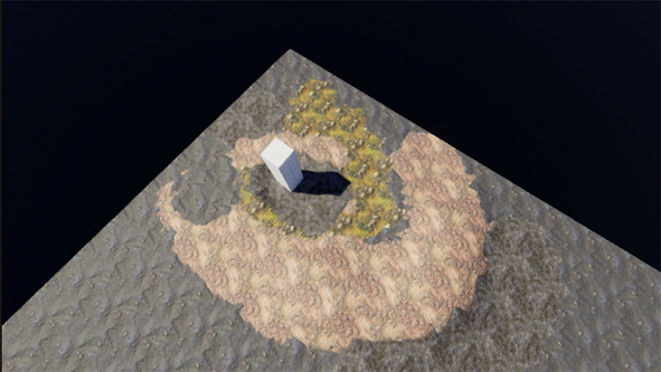
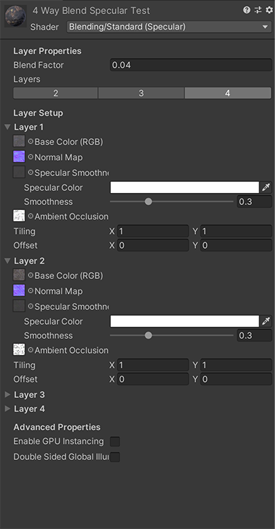

# Blendable Standard Shader

This package offers a surface shader with a similar setup to Unity's standard shaders that supports up to 4 blendable layers. The layers are controlled by the vertex colour of the mesh it is applied to, and can be edited in a 3D modelling package or with a tool like Polybrush.

The material is controlled with a custom inspector similar to the Unity Standard shader one.

## Installation
This package can be installed using the Unity Package manager. Add it as a git package.

Supports Unity 2018.1+

## License
Released under the MIT license. See LICENSE for details.